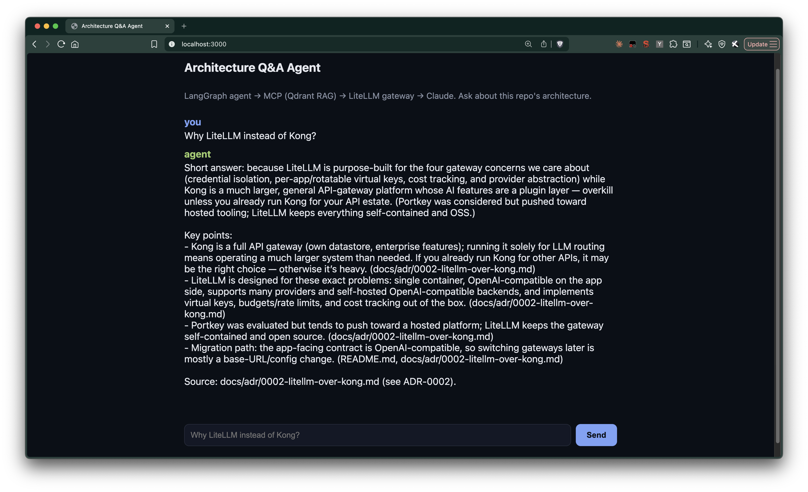
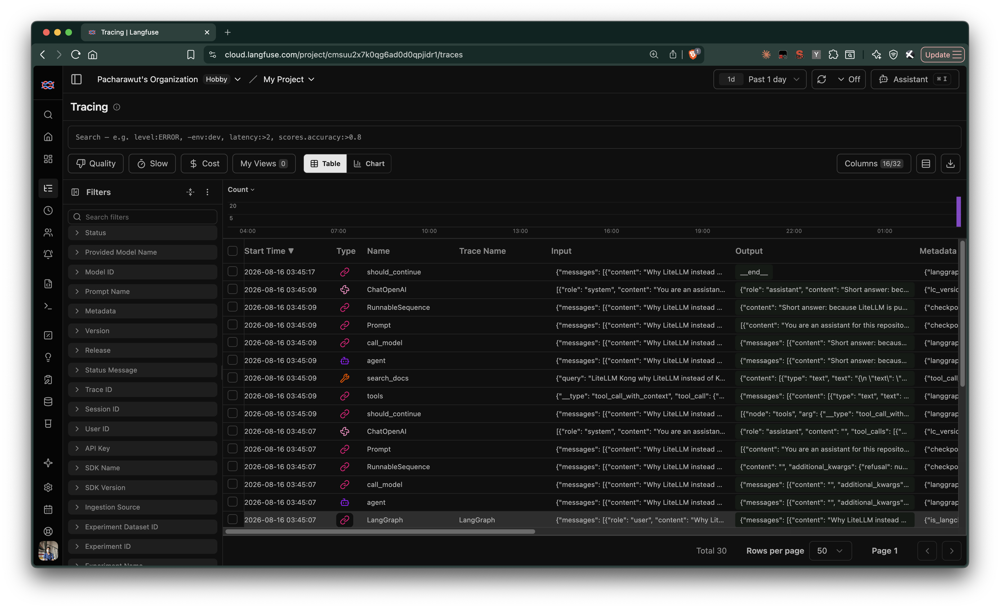
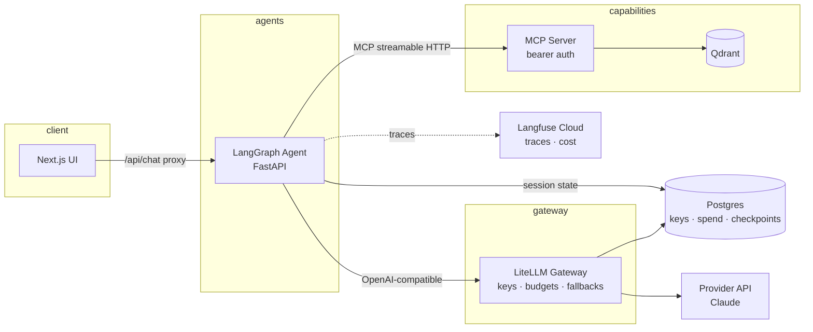

# Production LLM Agent Architecture (Open-Source Stack)

[](https://github.com/babebp/llm-agent-production-architecture/actions/workflows/ci.yml)
[](LICENSE)

A small but production-style LLM agent stack — single agent today, with the
boundaries already drawn for multi-agent (see Scaling path).

> **How this was built:** the architecture, component choices, and trade-offs
> are mine — that thinking is written down in the [ADRs](docs/adr/), which are
> the point of this repo. The implementation code was written by Claude from
> that design (AI writes code fast; deciding *what* to build and *why* is the
> part that still needs a human). Every component is the smallest thing that demonstrates the
production concern it stands for — the value here is the *architecture and
the decisions*, not the line count.

**Demo app:** a RAG agent that answers questions about this repository's own
architecture (the ADRs and this README are the corpus).



Every run is fully traced in Langfuse — each agent step, `search_docs` tool
call, and LLM call with latency and token usage:



## Architecture



| Concern | Component | Why this one |
|---|---|---|
| UI | Next.js 15 | Server-side proxy route; browser never reaches the agent network |
| Agent runtime | LangGraph | ReAct agent, Postgres-backed session memory ([ADR-0007](docs/adr/0007-postgres-agent-checkpointer.md)) |
| Tooling protocol | MCP | Vector DB exposed as a pluggable capability ([ADR-0003](docs/adr/0003-vector-db-as-mcp-server.md)) |
| Vector DB | Qdrant | Single container, local embeddings via fastembed ([ADR-0005](docs/adr/0005-local-embeddings-fastembed.md)) |
| AI gateway | LiteLLM + Postgres | Credential isolation, virtual keys, per-key spend ([ADR-0002](docs/adr/0002-litellm-over-kong.md), [ADR-0006](docs/adr/0006-db-backed-gateway-virtual-keys.md)) |
| Model serving | Provider API | No vLLM — and exactly when we'd add it ([ADR-0001](docs/adr/0001-api-llm-behind-gateway-not-vllm.md)) |
| Observability | Langfuse Cloud | Full traces without four extra stateful containers ([ADR-0004](docs/adr/0004-langfuse-cloud-over-self-host.md)) |

Design decisions are recorded as [ADRs](docs/adr/) — read those first; they
are the point of this repo.

## Security model

- **Provider keys exist in exactly one place** — the LiteLLM container. The
  agent holds a LiteLLM key; the UI holds nothing.
- **Every internal hop is authenticated**: agent → MCP uses a bearer token;
  agent → gateway uses a LiteLLM key.
- **Minimal network exposure**: only the UI (`:3000`) and the gateway
  (`:4000`, for local inspection) are published; Qdrant, MCP, and the agent
  are compose-network-internal.
- **Three credential tiers** ([ADR-0006](docs/adr/0006-db-backed-gateway-virtual-keys.md)):
  provider keys → LiteLLM master key (ops only) → per-app **virtual keys**
  with budgets and rate limits. The agent's key burns at most its budget and
  rotates with one script:

  ```bash
  ./gateway/issue-key.sh   # budgeted, rate-limited key for the agent
  ```
- **No secrets in the repo** — `.env` from `.env.example`; production swaps
  this for a secret manager (Secrets Manager / Vault / SOPS).
- Remaining hardening, documented not demo-blocking: OAuth on the MCP
  server, TLS.

## Quickstart

```bash
cp .env.example .env   # fill in ANTHROPIC_API_KEY, generate the other secrets
docker compose up -d --build
docker compose exec mcp python ingest.py   # index README + ADRs into Qdrant
open http://localhost:3000
```

The first `ingest.py` run downloads the embedding model (~130 MB, one-time);
give it a minute.

Ask it: *"Why LiteLLM instead of Kong?"* — the agent retrieves the ADR via
MCP and answers with the source cited.

## Tests & evals

- **Unit/contract tests** (`test_*.py` next to each service, run in CI):
  chunking edge cases, MCP bearer-auth boundary, `/chat` contract including
  upstream-failure mapping — no containers or API keys needed.
- **Retrieval eval**: a golden question set scored as hit-rate@4 against the
  live index — catches regressions from chunking/embedding/corpus changes
  without spending LLM tokens. **It gates CI**: every push re-indexes the
  corpus into a throwaway Qdrant and fails the build below 80% hit-rate.
  Locally:

  ```bash
  docker compose exec mcp python eval_retrieval.py
  ```

## Repository layout

```
apps/web/              Next.js UI + server-side proxy route
services/agent/        LangGraph ReAct agent (FastAPI, MCP client, Langfuse)
services/mcp-qdrant/   MCP server wrapping Qdrant + ingest + retrieval eval
gateway/               LiteLLM config + virtual-key issuance (issue-key.sh)
postgres/              init.sql: gateway DB + agent checkpoint DB
docs/adr/              Architecture Decision Records
.github/workflows/     CI: per-service tests + web build
docker-compose.yml     Full stack, healthchecks, internal-only networking
```

## Deliberate omissions

- **No streaming**: `/chat` returns the whole reply. ReAct + RAG latency is
  dominated by tool-call round trips, and SSE plumbing through proxy + agent
  would double the demo's surface for zero architectural signal. Adding it is
  contained: LangGraph `astream` in the agent, an SSE route in the proxy.
- **No request timeouts/rate limits at the proxy**: the trust boundary is
  enforced by validation at the agent and auth on every internal hop;
  timeout/rate policy belongs to the ingress layer this demo doesn't have.

## Scaling path (documented, intentionally not built)

- **Kubernetes/EKS**: each service is already a stateless container with a
  healthcheck; compose services map 1:1 to Deployments, Qdrant to a
  StatefulSet or managed Qdrant Cloud.
- **Agent state**: done — checkpoints live in Postgres
  ([ADR-0007](docs/adr/0007-postgres-agent-checkpointer.md)), so the agent
  is stateless and horizontal scale is a replica count.
- **Self-hosted models**: add a vLLM backend as a LiteLLM `model_list` entry
  — zero agent changes (ADR-0001).
- **Multi-agent**: additional agents join as new services consuming the same
  MCP capabilities and gateway; the boundaries are already drawn for it.
