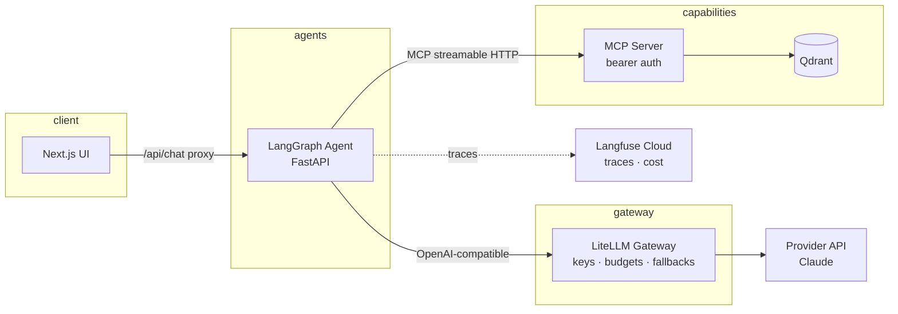

# Production-Minded Multi-Agent Architecture (Open-Source Stack)

A deliberately **minimal** reference implementation of a production LLM agent
architecture. Every component is the smallest thing that demonstrates the
production concern it stands for — the value here is the *architecture and
the decisions*, not the line count.

**Demo app:** a RAG agent that answers questions about this repository's own
architecture (the ADRs and this README are the corpus).

## Architecture



| Concern | Component | Why this one |
|---|---|---|
| UI | Next.js 15 | Server-side proxy route; browser never reaches the agent network |
| Agent runtime | LangGraph | ReAct agent + checkpointer for session memory |
| Tooling protocol | MCP | Vector DB exposed as a pluggable capability ([ADR-0003](docs/adr/0003-vector-db-as-mcp-server.md)) |
| Vector DB | Qdrant | Single container, local embeddings via fastembed ([ADR-0005](docs/adr/0005-local-embeddings-fastembed.md)) |
| AI gateway | LiteLLM | Credential isolation, virtual keys, cost tracking ([ADR-0002](docs/adr/0002-litellm-over-kong.md)) |
| Model serving | Provider API | No vLLM — and exactly when we'd add it ([ADR-0001](docs/adr/0001-api-llm-behind-gateway-not-vllm.md)) |
| Observability | Langfuse Cloud | Full traces without four extra stateful containers ([ADR-0004](docs/adr/0004-langfuse-cloud-over-self-host.md)) |

Design decisions are recorded as [ADRs](docs/adr/) — read those first; they
are the point of this repo.

## Security model

- **Provider keys exist in exactly one place** — the LiteLLM container. The
  agent holds a LiteLLM key; the UI holds nothing.
- **Every internal hop is authenticated**: agent → MCP uses a bearer token;
  agent → gateway uses a LiteLLM key.
- **Minimal network exposure**: only the UI (`:3000`) and the gateway
  (`:4000`, for local inspection) are published; Qdrant, MCP, and the agent
  are compose-network-internal.
- **No secrets in the repo** — `.env` from `.env.example`; production swaps
  this for a secret manager (Secrets Manager / Vault / SOPS).
- Production hardening documented, not demo-blocking: DB-backed LiteLLM
  virtual keys with budgets + rate limits, OAuth on the MCP server, TLS.

## Quickstart

```bash
cp .env.example .env   # fill in ANTHROPIC_API_KEY, generate the other secrets
docker compose up -d --build
docker compose exec mcp python ingest.py   # index README + ADRs into Qdrant
open http://localhost:3000
```

Ask it: *"Why LiteLLM instead of Kong?"* — the agent retrieves the ADR via
MCP and answers with the source cited.

## Repository layout

```
apps/web/              Next.js UI + server-side proxy route
services/agent/        LangGraph ReAct agent (FastAPI, MCP client, Langfuse)
services/mcp-qdrant/   MCP server wrapping Qdrant + ingest script
gateway/               LiteLLM config (models, master key)
docs/adr/              Architecture Decision Records
docker-compose.yml     Full stack, healthchecks, internal-only networking
```

## Scaling path (documented, intentionally not built)

- **Kubernetes/EKS**: each service is already a stateless container with a
  healthcheck; compose services map 1:1 to Deployments, Qdrant to a
  StatefulSet or managed Qdrant Cloud.
- **Agent state**: swap LangGraph's in-memory checkpointer for the
  Postgres/Redis saver to scale the agent horizontally.
- **Self-hosted models**: add a vLLM backend as a LiteLLM `model_list` entry
  — zero agent changes (ADR-0001).
- **Multi-agent**: additional agents join as new services consuming the same
  MCP capabilities and gateway; the boundaries are already drawn for it.
